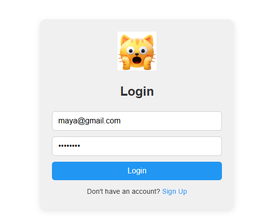
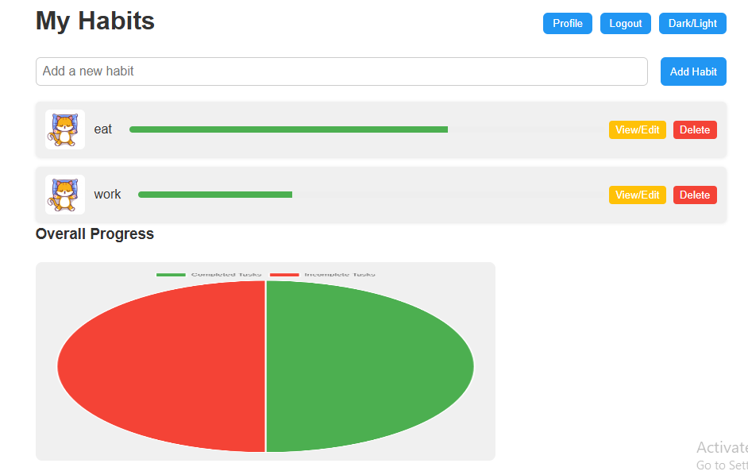
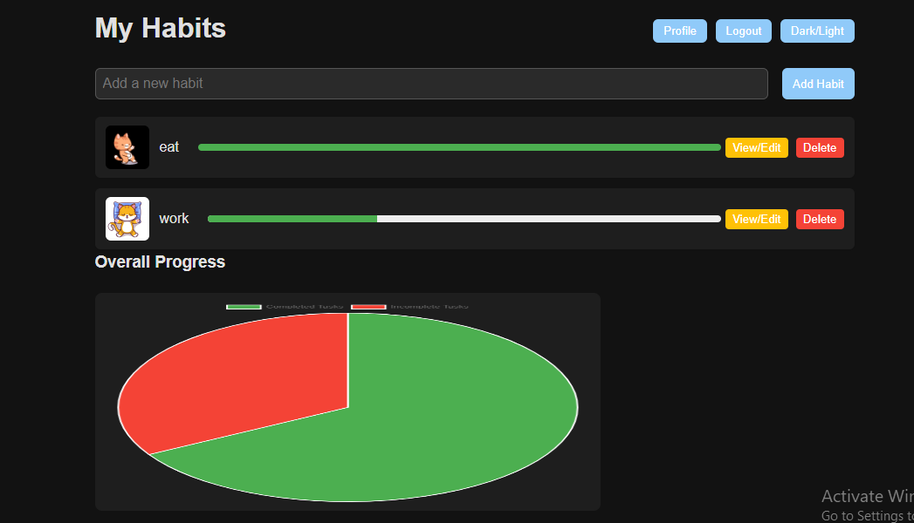
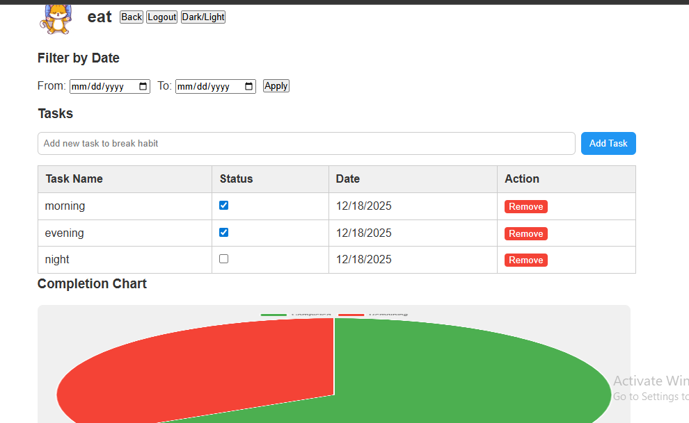
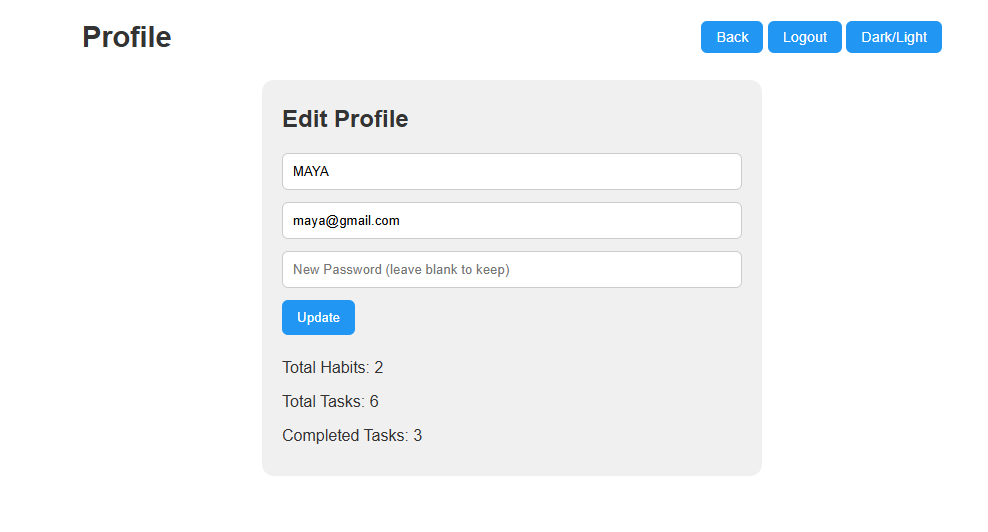

# 🐱 Tinny – Habit Tracker Web App

---

## 🚀 Project Overview
**Tinny** is a dynamic habit tracker web application built with **HTML, CSS, and JavaScript**, integrated with **Firebase Authentication and Firestore** for real-time data management.  
The app helps users create, track, and complete habits while visualizing their overall progress.

**Purpose:**  
- Provide a modern, interactive habit tracking experience  
- Showcase front-end development and Firebase integration skills  
- Create a responsive, portfolio-ready web app  

**Key Highlights:**  
- User authentication with Firebase Auth  
- Real-time habit and task management using Firestore  
- Interactive progress bars and overall progress chart  
- Light and dark mode toggle for improved UX  

---

## 🌟 Portfolio-Ready Highlights
- **Interactive UX:** Complete or view/edit habits dynamically  
- **Data Visualization:** Pie chart for overall progress  
- **Responsive Design:** Works seamlessly on desktop and mobile  
- **Themed Visuals:** Cute animated cats for habit completion  
- **Firebase Integration:** Secure, real-time backend for tasks and habits  
- **Light/Dark Mode:** Toggle between themes for better usability  

---

## 🎯 Features
- **Add, Edit, Delete Habits:** Manage personal habits efficiently  
- **Track Tasks:** Complete tasks under each habit with progress bars  
- **Overall Progress Chart:** Visual representation of completed vs incomplete habits  
- **Authentication:** Sign in and manage personal habits securely  
- **Profile Management:** Edit user profile  
- **Light/Dark Theme:** Switch between modes for comfort  
- **Responsive Design:** Optimized for multiple devices  

---

## 🛠 Tech Stack
| Technology | Role |
|------------|------|
| HTML       | Structure and semantic layout |
| CSS        | Styling, responsive design, animations, theme toggle |
| JavaScript | Dynamic behavior, event handling, chart updates |
| Firebase Auth & Firestore | User authentication and real-time database |

> The full project code is **private**; screenshots are used to showcase functionality.

---

## 📸 Screenshots Gallery
Here’s a visual walkthrough of the project:

| Screenshot | Description |
|------------|-------------|
|  | **Sign Up Page** – User registration interface |
|  | **Login Page** – Secure login for returning users |
|  | **Dashboard** – Main dashboard showing all habits and tasks |
|  | **Dashboard Dark Mode** – Same dashboard with dark theme |
|  | **Habit Details Page** – View and edit tasks of a specific habit |
|  | **Profile Page** – Edit user profile and settings |

---

## 🌐 Live Demo
Experience the live application here: [Tinny](https://tinny-dca49.web.app/)

---

## 📖 Project Walkthrough
1. **Sign Up (t1)** – Create a secure account with Firebase Auth  
2. **Login (t2)** – Access the app with authenticated credentials  
3. **Dashboard (t3 & t4)** – View all habits, add tasks, and track progress  
4. **Habit Details (t6)** – Manage individual tasks for each habit  
5. **Profile Page (t7)** – Update personal details and settings  
6. **Progress Chart** – See visual representation of completed vs incomplete habits  

---

## 🧠 Skills & Learnings
- Integrating Firebase Auth and Firestore with front-end JavaScript  
- Building interactive and dynamic UI elements  
- Creating responsive web designs with light/dark themes  
- Displaying data with charts and progress bars  
- Professional project documentation for portfolio showcase  

---

## ⚡ Challenges & Solutions
**Challenges:**  
- Syncing tasks and habits in real-time  
- Maintaining responsive design across multiple devices  
- Implementing light/dark mode with consistent UI  

**Solutions:**  
- Used Firebase Firestore for real-time data updates  
- Applied CSS media queries and flexible layouts  
- Implemented theme toggle with CSS variables for seamless switching  

---

## 🔮 Future Improvements
- Add notifications or reminders for incomplete tasks  
- Introduce habit streak tracking for user motivation  
- Enable drag-and-drop task ordering  
- Implement more visual themes or customizations  
- Add analytics for user habit trends  

---

## 🎉 Conclusion
**Tinny** is a fully interactive, responsive, and visually engaging habit tracker web app.  
It demonstrates strong **front-end skills**, **Firebase integration**, and professional project documentation suitable for a **portfolio showcase**.
